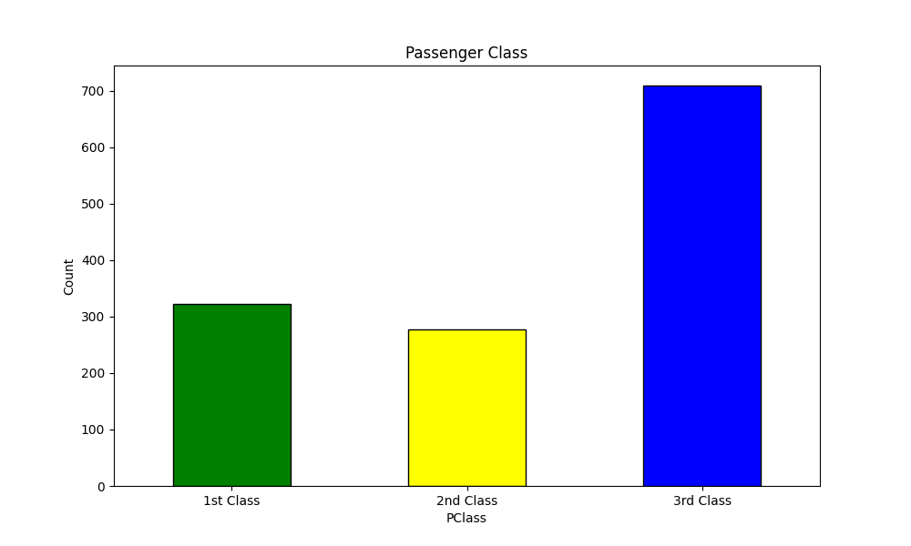

# Titanic Data Analysis

## Introduction

This project aims to analyze the Titanic dataset to understand the factors affecting the survival rate of passengers. The analysis includes data cleaning, exploratory data analysis, feature engineering, and data visualization.

## Dataset

## Dataset

The dataset used for this analysis is the Titanic dataset, which contains detailed information about the passengers aboard the Titanic, including age, sex, fare, passenger class, and survival status. The dataset is sourced from Kaggle and can be accessed [here](https://www.kaggle.com/datasets/heptapod/titanic).


## Project Structure

- `titanic_passanger_survival.ipynb`: Jupyter Notebook containing the entire analysis.
- `age_distribution.png`: Image file for the age distribution plot.
- `survival_rate.png`: Image file for the survival rate plot.
- `passenger_class_distribution.png`: Image file for the passenger class distribution plot.
- `survival_rate_by_sex.png`: Image file for the survival rate by sex plot.
- `survival_rate_by_pclass.png`: Image file for the survival rate by passenger class plot.
- `survival_rate_by_age.png`: Image file for the survival rate by age plot.
- `README.md`: This file.

## Data Cleaning

- Removed unnecessary columns.
- Renamed the column names appropriately.
- Handled missing values in the 'Embarked' column.

## Exploratory Data Analysis

### Age Distribution


### Survival Rate


### Passenger Class Distribution


## Feature Engineering

- Converted the columns 'Sex' and 'Embarked' from numerical to string.
- Created a new column 'FamilySize'.

## Data Visualization

### Survival Rate by Sex


### Survival Rate by Passenger Class


### Survival Rate by Age


## Conclusion

- **Sex**: Females had a higher survival rate than males.
- **Pclass**: Passengers in the higher class (1st class) had a higher survival rate.
- **Age**: Younger passengers had a slightly higher survival rate.

## Getting Started

To replicate this analysis, follow these steps:

1. Clone this repository.
2. Install the required dependencies listed in `requirements.txt`.
3. Open the `titanic_analysis.ipynb` Jupyter Notebook and run the cells.

## Requirements

- Python 3.x
- Pandas
- Matplotlib
- Seaborn

You can install the required libraries using:

```sh
pip install pandas matplotlib seaborn
